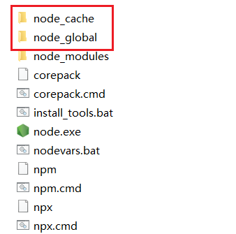
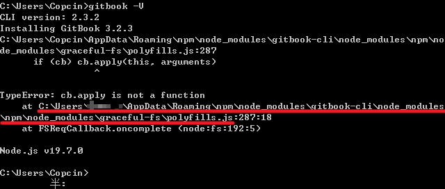

# Node.js安装(Windows)

要使用 `GitBook` 我们得先安装它的命令行工具 `gitbook-cli`。而安装 `gitbook-cli` 得先安装 `Node.js`。

##### 进入[Node.js官网](https://nodejs.org/zh-cn/download/prebuilt-installer)下载安装包并运行（根据自己电脑选择32位还是64位）。

 

##### 选择安装路径，然后点击下一步

 

##### 这里四项全部安装，点击下一步

 

##### 这里不用打勾✔，下一步

 

##### 选择Install安装，等安装完成即可

 

##### 进入命令提示符窗口，分别输入以下命令，显示版本号，则安装成功

```bash
node -v # 显示安装的nodejs版本
npm -v # 显示安装的npm版本
```

# 修改全局模块路径和缓存路径（可选）

当我们在执行`npm install express -g`命令时，g表示global全局。会默认下载到c盘，它的默认路径为：【C:\Users\用户名\AppData\Roaming\npm】。

##### 在Node.js安装目录下创建两个文件夹，node_global和node_cache

 

##### 设置node_global和node_cache权限

 

##### win+R打开运行窗口，输入cmd，再执行以下两条指令

```bash
npm config set prefix "node_global文件夹所在路径"
npm config set cache "node_cache文件夹所在路径"
```

##### 执行完毕后，再配置环境变量

右键此电脑——>高级系统设置——>环境变量

* 在系统变量中，新建，变量名：`NODE_HOME`   变量值：Node.js安装路径
  
   
  
* 在系统变量的Path中将原来Node.js路径修改为`%NODE_HOME%`，并添加%NODE_HOME%\node_global

   

##### 设置淘宝镜像

通过npm命令行工具设置全局镜像地址，可以持久保存在用户的npm配置中：

```bash
npm config set registry https://registry.npmmirror.com/
```

请注意，淘宝npm镜像原地址 `https://registry.npm.taobao.org` 在2022年6月30日后已不再可用，因此应使用新地址 `https://registry.npmmirror.com/`。

# 安装GitBook

打开cmd，执行`gitbook-cli`安装命令

```bash
npm install gitbook-cli -g
```

安装完成后，执行`gitbook -V`查看 gitbook-cli 版本号并安装 gitbook 本体。

> [!Tip]
>
> 使用12.5.0以上的版本（只测试了12.4.1没问题，但网上有用12.8.3的报错的）才会有下面的报错，所以推荐使用10+至12.4.1的版本，10以下也会有问题。

不出意料，它报了一个错：

 

找到错误中那个 polyfills.js 文件的位置，即上图中画横线的部分。然后打开它，注释掉以下内容：

 

保存，重新 `gitbook -V`，应该就能安装成功了。

# GitBook初始化错误

找到一个空文件夹，在该目录下打开cmd，执行`gitbook init`初始化一个书籍项目。  
不出意外，它又报错了：

 

打开"C:\Users\用户名\.gitbook\versions\3.2.3\lib\init.js"这个文件  
将第 72 行的 `return fs.writeFile(filePath, summary.toText(extension)); `修改为：

```javascript
return summary.toText(extension).then(stx=>{return fs.writeFile(filePath, stx);});
```

保存，重新 `gitbook init`，就可以了。

这时我们会发现出现了两个文件：README.md 与 SUMMARY.md。README.md 是用来写简介的，SUMMARY.md 是用来写目录的。
