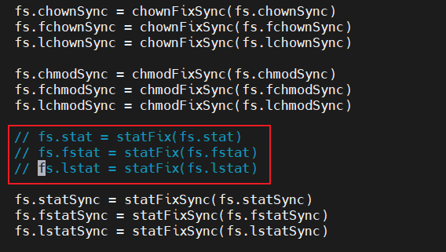

# Node.js安装(Linux)

依次执行以下命令（需要开启代理）：

```bash
curl -fsSL https://fnm.vercel.app/install | bash
source ~/.bashrc
fnm use --install-if-missing 20
node -v # 显示安装的nodejs版本
npm -v # 显示安装的npm版本
```

显示版本则代表安装成功：

 

# GitBook安装

执行以下命令，安装gitbook-cli：

```bash
npm install gitbook-cli -g
```

安装完成后，执行`gitbook -V`，此时会报一个错：


打开错误中的polyfills.js文件，注释掉以下内容：

 

保存，重新执行`gitbook -V`，等待GitBook 3.2.3安装完成。

# GitBook初始化

打开 /root/.gitbook/versions/3.2.3/lib/init.js 这个文件，  
将第 72 行的 `return fs.writeFile(filePath, summary.toText(extension)); `替换为：

```javascript
return summary.toText(extension).then(stx=>{return fs.writeFile(filePath, stx);});
```

保存后，创建一个空文件夹，进入该文件夹并执行 `gitbook init`

这时会发现出现两个文件：README.md 与 SUMMARY.md。README.md 是用来写简介的，SUMMARY.md 是用来写目录的。
