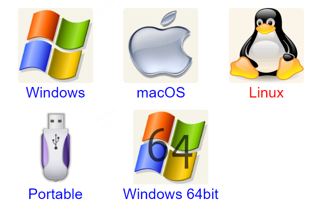

# 导出电子书


**目前为止，Gitbook 支持如下输出：**

- 静态HTML（静态网站）
- PDF格式
- eBook格式
- Mobi 格式


>  [!TIP|style:flat]
>
> 目前常见的电子书格式主要主要有三种(`ePub`, `Mobi`, `PDF`)，在 `Gitbook` 中导出这三种格式都依赖于系统本身提供的 `ebook-convert` 工具支持。但是新版的gitbook，官方已经不再提供支持，因此需要安装第三方的`ebook-convert` 工具。比较常用的 convert 有 calibre。


# 安装calibre

calibre 官网：https://calibre-ebook.com

下载地址：http://calibre-ebook.com/download

 

#### Linux

```bash
sudo apt install calibre
```

#### Mac

下载 `Calibre.app`。移动 `calibre.app` 到你的应用程序文件夹中后，给 `ebook-convert` 工具创建一个符号链接。

```bash
$ sudo ln -s ~/Applications/calibre.app/Contents/MacOS/ebook-convert /usr/bin
```

你可以把 /usr/bin 替换为 $PATH 中的任何的文件夹。

#### Windows

安装 `calibre-4.5.0.msi` 到本机环境，如果选择了默认配置，不需要配置环境变量。

##### ebook-convert –version

```
D:\gitbook> ebook-convert --version
ebook-convert.exe (calibre 4.5.0)
Created by: Kovid Goyal <kovid@kovidgoyal.net>
```

有输出版本证明安装成功。


# 配置 pdf

可以使用 book.json 中的一组选项来定制PDF输出：

| 参数名            | 描述                                                         |
| ----------------- | ------------------------------------------------------------ |
| pdf.pageNumbers   | 将页码添加到每个页面的底部（默认为 true）                    |
| pdf.fontSize      | 基本字体大小（默认是 12）                                    |
| pdf.fontFamily    | 基本字体样式（默认是 Arial）                                 |
| pdf.paperSize     | 页面尺寸，选项有： 'a0', 'a1', 'a2', 'a3', 'a4', 'a5', 'a6', 'b0', 'b1', 'b2', 'b3', 'b4', 'b5', 'b6', 'legal', 'letter' （默认值是 a4） |
| pdf.margin.top    | 上边界（默认值是 56）                                        |
| pdf.margin.bottom | 下边界（默认值是 56）                                        |
| pdf.margin.right  | 右边界（默认值是 62）                                        |
| pdf.margin.left   | 左边界（默认值是 62）                                        |


# 基本命令


> [!Note|style:flat]
>
> 语法格式: 
>
> - gitbook build：导出静态网站HTML格式文件
>
> - gitbook pdf：导出PDF格式文件
>
> - gitbook epub：导出ePub格式文件
>
> - gitbook mobi：导出Mobi格式文件


简单示例：

```bash
# 1. 生成 `html` 静态网站文件并输出 `debug` 级别日志
$ gitbook build --log=debug

# 2. 生成 `pdf` 文件并输出 `debug` 级别日志
$ gitbook pdf book.pdf --log=debug

# 3. 生成 `epub` 文件并输出 `debug` 级别日志
$ gitbook epub book.epub --log=debug

# 4. 生成 `mobi` 文件并输出 `debug` 级别日志
$ gitbook mobi book.mobi --log=debug
```
